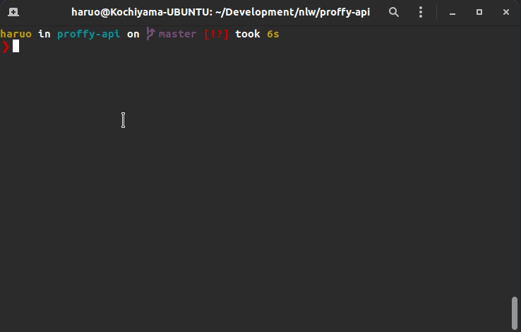

<h1 style="text-align: center; font-size: 50px">
  Proffy API
</h1>

Full stack project with mobile, web and API. A plataform that connects inependent teachers and students.
Project initially developed at **Next Level Week #2** from @Rocketseat.
 
### The complete project is constituted by these three repositories:

- [Web](https://github.com/Kochiyama/proffy-web) 
- [Mobile](https://github.com/Kochiyama/proffy-mobile) 
- [Api](https://github.com/Kochiyama/proffy-api)

### Current Project State: :hammer_and_wrench: Working :hammer_and_wrench: 
---
## Features list (also todo-list)

- [x] **Recieve** teacher data and **register** the new teacher on **database**
- [x] **Return** filtered teacher classes
- [x] **Store** total Connections (how many students used the 'whatsapp button' to contact a teacher)
- [x] **Return** the total number of connections
- [ ] **Return** all teacher classes using pagination
- [ ] **Store** student and teacher data
- [ ] **Update** student and teacher data
- [x] **Add** authentication for all users
- [ ] **Store** the favorites on database

---
## Preview: web application consuming this API


---

## Dependencies (Pre-requisites)

Before try :microscope: proffy-api from your own local network you must have installed the following dependencies:

- [NodeJS](https://nodejs.org/en/download/)
- [yarn](https://classic.yarnpkg.com/en/docs/install/#debian-stable)
- [git](https://git-scm.com/downloads)

## Test the dependencies
Into your terminal run:  

### Node

```
node --version
```
Output expected:   
`v12.8.3`

### Yarn

```
yarn --version
```
Output expected:  
`v1.22.4`

### Git

```
git --version
```
Output expected:  
`git version 2.25.1`

The versions can vary, if they vary too much and some bug occur, unninstall the current version and install the exact version of outputs above. 

## Set up the API

Clone this repository, into your terminal run: 
```
git clone https://github.com/Kochiyama/proffy-api
```

Then change the actual directory to the proffy-api folder, run: 
```
cd proffy-api
```

Install all the packages automatically, just run: 
```
yarn
```

Set up the Database
```
yarn knex:migrate
```  
It will create the `database.sqlite` file with all the needed tables

And finally: 
```
yarn start
```



---
## Discover your local ip

:warning: **If you already know your local ip skip this section**

We are looking for your computer IPv4  
Follow the respective tutorial (it depends on your OS):

- [windows](https://support.microsoft.com/en-us/help/4026518/windows-10-find-your-ip-address)
- [Linux](https://www.wikihow.com/Find-Your-IP-Address-on-a-Mac)
- [mac](https://opensource.com/article/18/5/how-find-ip-address-linux)

---
## End Points (used by the front ends)

GET `/connections`  
Show the total connections on your network

POST `/connections`  
Add +1 conecction to the database

Get `/classes`  
filter and show classes (require filter)

Post `/classes`  
Register a teacher/class

---

# All right for the launch :rocket:

To test the api in the best way, visit the [web](https://github.com/Kochiyama/proffy-web) and/or [mobile](https://github.com/Kochiyama/proffy-mobile) repositories and follow the instructions to set up your front-end to consume your fresh started api.

---

## Address to consume the api
`'http://[yourLocalIp]:3333/'`  

:warning: replace '[yourLocalIp]' by your real local ip.  

example:

`http://192.168.0.100:3333/`

---

## :black_nib: Feedback
If you found a bug or error feel free to create a **new issue** on this repository  
Any feeedbacks and opinions are welcome, send me a e-mail:
marcelokochiyamadev@gmail.com